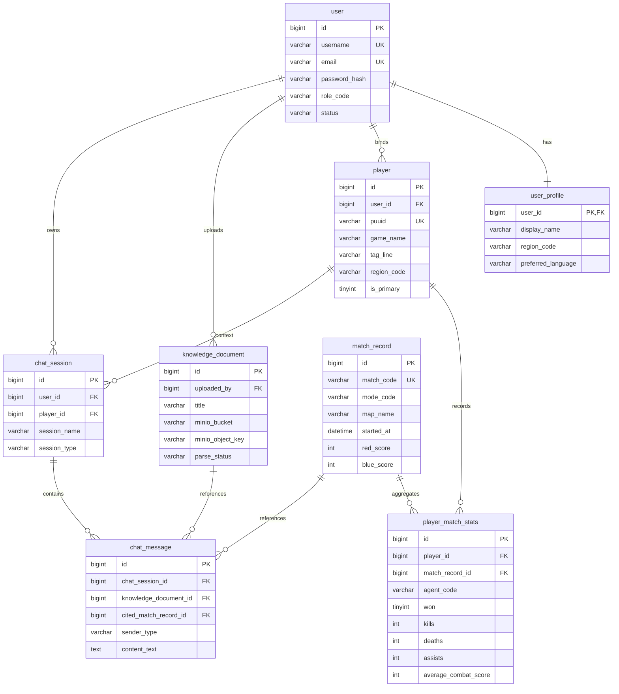

# Valorant Assistant MVP E-R Diagram

```mermaid
erDiagram
    user ||--|| user_profile : has
    user ||--o{ player : binds
    user ||--o{ knowledge_document : uploads
    user ||--o{ chat_session : owns

    player ||--o{ player_match_stats : records
    match_record ||--o{ player_match_stats : aggregates

    player ||--o{ chat_session : context
    chat_session ||--o{ chat_message : contains
    knowledge_document ||--o{ chat_message : references
    match_record ||--o{ chat_message : references

    user {
        bigint id PK
        varchar username UK
        varchar email UK
        varchar password_hash
        varchar role_code
        varchar status
    }

    user_profile {
        bigint user_id PK,FK
        varchar display_name
        varchar region_code
        varchar preferred_language
    }

    player {
        bigint id PK
        bigint user_id FK
        varchar puuid UK
        varchar game_name
        varchar tag_line
        varchar region_code
        tinyint is_primary
    }

    match_record {
        bigint id PK
        varchar match_code UK
        varchar mode_code
        varchar map_name
        datetime started_at
        int red_score
        int blue_score
    }

    player_match_stats {
        bigint id PK
        bigint player_id FK
        bigint match_record_id FK
        varchar agent_code
        tinyint won
        int kills
        int deaths
        int assists
        int average_combat_score
    }

    knowledge_document {
        bigint id PK
        bigint uploaded_by FK
        varchar title
        varchar minio_bucket
        varchar minio_object_key
        varchar parse_status
    }

    chat_session {
        bigint id PK
        bigint user_id FK
        bigint player_id FK
        varchar session_name
        varchar session_type
    }

    chat_message {
        bigint id PK
        bigint chat_session_id FK
        bigint knowledge_document_id FK
        bigint cited_match_record_id FK
        varchar sender_type
        text content_text
    }
```
