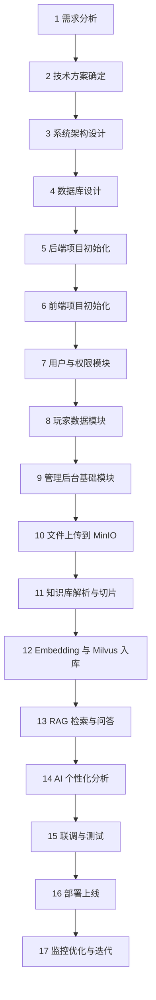

# Valorant AI Assistant 完整开发流程

## 1. 项目概述

本项目目标是构建一个面向《无畏契约 / VALORANT》玩家的 AI 助手系统，结合玩家对局数据分析、知识库检索和大模型问答能力，为用户提供战绩查询、个性化建议、版本理解与训练指导。

当前采用的技术方案如下：

- 后端：`Java 21`、`Spring Boot`、`Spring Security`、`Spring AI`
- ORM：`Spring Data JPA` / `MyBatis-Plus`
- 业务数据库：`MySQL 8.x`
- 缓存：`Redis`
- 对象存储：`MinIO`
- 向量库：`Milvus`
- 前端：`Vue 3`、`TypeScript`、`Pinia`、`Vue Router`、`Element Plus`
- 图表：`ECharts`
- 部署：`Docker Compose`、`Nginx`

## 2. 系统职责划分

### 2.1 MySQL

用于存储结构化业务数据，包括：

- 用户信息
- 玩家账号信息
- 对局记录
- 玩家对局统计
- 知识文档元数据
- 聊天会话与问答记录

### 2.2 Redis

用于提升系统性能和稳定性，包括：

- 登录态缓存
- 热点玩家数据缓存
- 接口限流
- 短期统计结果缓存

### 2.3 MinIO

用于存储原始文件对象，包括：

- 攻略文档
- 补丁说明
- 上传的 PDF / DOCX / TXT / Markdown 文件
- 导出报告
- 静态资源

说明：

`MinIO` 是对象存储系统，可以理解为自建的轻量级文件仓库。文件本体存放在 `MinIO` 中，而文件名、分类、来源、上传时间等信息存放在 `MySQL` 中。

### 2.4 Milvus

用于存储文档切片后的向量数据，包括：

- 文档片段向量
- 检索所需的元数据索引

当用户提问时，系统从 `Milvus` 中检索最相关的知识片段，再交由大模型生成回答。

## 3. 总体开发流程



## 4. 分阶段开发说明

### 4.1 需求分析阶段

目标是明确项目边界和 MVP 范围。

主要工作：

- 明确目标用户：普通玩家、进阶玩家、管理员
- 明确核心能力：战绩查询、知识问答、AI 建议
- 明确 MVP 范围：先实现可运行的业务系统，再逐步接入 RAG
- 输出需求文档、用例清单、功能清单

阶段产出：

- 需求分析文档
- 功能模块说明
- MVP 版本范围

### 4.2 技术方案与系统架构设计阶段

目标是确定整体系统边界、职责分层与组件协作方式。

主要工作：

- 确定后端技术栈与前端技术栈
- 确定 `MySQL + Redis + MinIO + Milvus` 的组合职责
- 设计系统模块边界
- 确定后续接入大模型与 RAG 的方式

建议模块：

- 用户模块
- 玩家模块
- 对局模块
- 知识库模块
- RAG 问答模块
- AI 分析模块
- 管理后台模块

阶段产出：

- 系统架构图
- 模块划分说明
- 技术选型说明

### 4.3 数据库设计阶段

目标是完成业务数据建模，优先支持第一个可运行版本。

优先设计的核心表：

- `user`
- `user_profile`
- `player`
- `match_record`
- `player_match_stats`
- `knowledge_document`
- `chat_session`
- `chat_message`

设计原则：

- 优先满足登录、玩家查询、对局展示
- 文档原始文件不直接入库，文件本体交由 `MinIO`
- 知识切片向量不进入 `MySQL`，而是进入 `Milvus`

阶段产出：

- E-R 关系图
- 建表 SQL
- 字段字典

### 4.4 后端项目初始化阶段

目标是搭建稳定、可扩展的后端工程骨架。

主要工作：

- 初始化 `Spring Boot` 项目
- 集成 `Spring Security`
- 集成 `JPA / MyBatis-Plus`
- 配置 `MySQL`
- 配置 `Redis`
- 统一返回体
- 统一异常处理
- 日志配置
- 环境配置文件拆分

建议目录：

```text
backend/
├─ common
├─ auth
├─ user
├─ player
├─ match
├─ knowledge
├─ rag
├─ ai
├─ admin
└─ task
```

阶段产出：

- 可启动后端项目
- 基础配置完成
- 公共模块可复用

### 4.5 前端项目初始化阶段

目标是搭建页面骨架与前端工程规范。

主要工作：

- 初始化 `Vue 3 + Vite + TypeScript`
- 配置 `Pinia`
- 配置 `Vue Router`
- 集成 `Element Plus`
- 封装请求工具
- 设计基础布局
- 设计路由守卫

建议目录：

```text
frontend/
├─ api
├─ assets
├─ components
├─ layout
├─ router
├─ stores
├─ utils
└─ views
```

阶段产出：

- 可运行前端项目
- 登录页与基础布局页
- 接口调用基础能力

### 4.6 用户与权限模块开发阶段

目标是先把系统使用入口打通。

主要工作：

- 注册/登录
- JWT 鉴权
- 角色权限控制
- 个人资料维护

阶段产出：

- 登录接口
- 登录页面
- 路由鉴权
- 权限基础能力

### 4.7 玩家数据模块开发阶段

目标是先实现没有 AI 也可独立运行的业务核心。

主要工作：

- 玩家账号绑定
- 玩家基础信息查询
- 最近对局查询
- 对局详情展示
- 玩家历史统计分析
- 地图 / 特工 / 战绩维度统计

阶段产出：

- 玩家主页
- 最近对局列表
- 基础统计图表

### 4.8 管理后台基础模块开发阶段

目标是为后续知识库与内容维护提供后台入口。

主要工作：

- 后台首页
- 用户管理
- 文档管理入口
- 基础日志查询

阶段产出：

- 后台基础页面
- 管理员访问入口

### 4.9 文件上传与对象存储阶段

目标是建立知识库原始文档的文件管理能力。

主要工作：

- 接入 `MinIO`
- 完成文件上传接口
- 完成文件访问链接生成
- 保存文档元数据到 `MySQL`

典型流程：

1. 管理员上传文档
2. 文件写入 `MinIO`
3. 文档元信息写入 `knowledge_document`
4. 触发解析任务

阶段产出：

- 文件上传能力
- 文档元数据表
- 文档状态流转

### 4.10 知识库解析与切片阶段

目标是把原始文档转成可供检索的知识片段。

主要工作：

- 解析 `TXT / PDF / DOCX / Markdown`
- 文本清洗
- 分段切片
- 为切片补充元数据

建议元数据：

- 文档标题
- 文档来源
- 文档分类
- 版本号
- 地图
- 特工
- 语言
- 时间

阶段产出：

- 切片结果
- 文档结构化文本
- 检索前数据准备

### 4.11 Embedding 与向量入库阶段

目标是把知识切片变成可向量检索的数据。

主要工作：

- 选择 Embedding 模型
- 对切片文本生成向量
- 将向量写入 `Milvus`
- 为向量绑定业务元数据

阶段产出：

- 向量化流程
- 向量入库任务
- 检索前索引准备

### 4.12 RAG 检索与问答阶段

目标是构建最小可用的 AI 问答链路。

主要工作：

- 用户输入问题
- 检索相关知识片段
- 拼接 Prompt
- 调用大模型生成回答
- 输出引用来源

推荐能力：

- 关键词检索 + 向量检索
- 元数据过滤
- 来源引用
- 问答日志记录

阶段产出：

- 基础 AI 问答功能
- 问答页面
- 引用来源展示

### 4.13 AI 个性化分析阶段

目标是将玩家业务数据和知识库问答结合起来。

主要工作：

- 分析最近 `N` 局表现
- 识别短板指标
- 输出训练建议
- 结合地图 / 特工 / 当前版本给出策略建议

典型场景：

- “我最近 20 把为什么总输？”
- “我在 Ascent 玩 Omen 有什么问题？”
- “当前版本我更适合练哪个特工？”

阶段产出：

- 对局总结
- 个性化建议
- 训练推荐报告

### 4.14 联调与测试阶段

目标是验证系统可用性、稳定性和协作链路是否完整。

主要工作：

- 后端接口测试
- 前后端联调
- 登录与权限测试
- 文件上传测试
- 文档解析测试
- 向量检索测试
- AI 回答质量测试
- 缓存与异常场景测试

阶段产出：

- 测试记录
- 问题修复清单
- 可上线版本

### 4.15 部署上线阶段

目标是完成本地或服务器环境部署。

主要工作：

- 使用 `Docker Compose` 编排服务
- 部署后端、前端、`MySQL`、`Redis`、`MinIO`、`Milvus`
- 使用 `Nginx` 做反向代理
- 配置环境变量与日志目录

阶段产出：

- 可访问测试环境
- 部署文档
- 启动与停止脚本

### 4.16 监控优化与迭代阶段

目标是持续提升可用性和问答效果。

主要工作：

- 统计接口响应时间
- 统计知识检索命中率
- 分析用户反馈
- 优化切片策略
- 优化提示词模板
- 增加缓存命中率

阶段产出：

- 性能优化记录
- RAG 质量优化记录
- 新版本迭代计划

## 5. 建议开发顺序

建议按以下顺序推进，降低整体难度：

1. 先完成 `登录 + 玩家 + 对局 + 前端页面`
2. 再接入 `MinIO + 文档管理`
3. 再实现 `文档切片 + Embedding + Milvus`
4. 最后实现 `RAG + AI 个性化建议`

这样做的好处：

- 前期完全基于熟悉技术栈开发
- 即使 RAG 暂时没有完成，系统也可单独演示
- 后续 AI 模块可以逐步独立接入

## 6. 第一阶段重点建议

考虑到当前开发者对前后端和数据库较熟悉、对 RAG 还处于概念认知阶段，建议第一阶段重点放在：

- 项目骨架搭建
- `MySQL` 表设计
- 登录与权限
- 玩家与对局模块
- 前端页面框架

与此同时，学习 RAG 时重点掌握以下最小闭环：

1. 文档采集
2. 文本切片
3. Embedding
4. 向量存储
5. 相似度检索
6. 拼接 Prompt 生成回答

## 7. 结论

该项目推荐采用“先业务系统、后 AI 增强”的策略推进：

- 先完成一个没有 AI 也能运行的瓦洛兰特数据分析系统
- 再将知识库与 RAG 问答模块作为增强能力接入

这种方式更符合当前开发能力结构，也能最大化降低项目中途卡住的风险。
